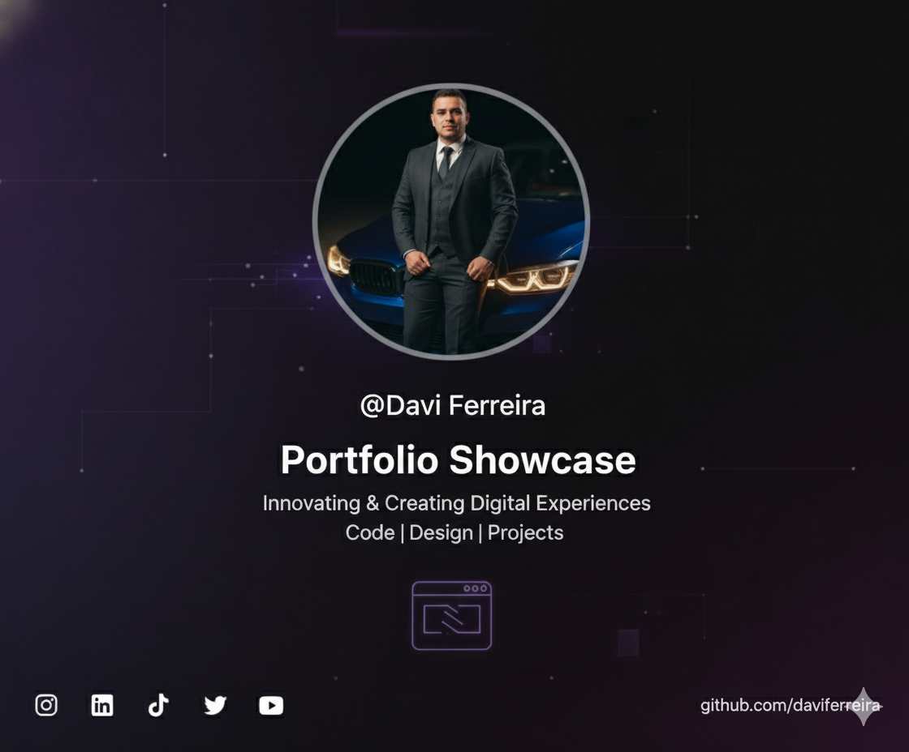

<h1 align="center">Portfólio — Davi Ferreira</h1>

  

  
<strong>@Davi Ferreira</strong>

  Portfólio pessoal desenvolvido para apresentar minha trajetória como Barbeiro e Criador de Conteúdo, 
  incluindo links para agendamentos, formações e redes sociais.

---

## 🚀 Tecnologias

Esse projeto foi desenvolvido com as seguintes tecnologias:

- HTML e CSS
- JavaScript
- Git & Github
- Figma

---

## 📌 Funcionalidades

✅ Tema Light/Dark com controle no topo

✅ Links para redes sociais

✅ Botões estilizado

✅ Interface moderna com foco em identidade pessoal

---

## 🔗 Acesse o projeto

👉 **Clique aqui para acessar online:**  
https://seu-usuario.github.io/seu-repositorio

> Substitua acima pela URL do GitHub Pages, caso já tenha publicado.

---

## 📱 Redes sociais

[Instagram](https://instagram.com/supremoxxt?igshid=YmMyMTA2M2Y=) •
[LinkedIn](http://www.linkedin.com/in/davi-ferreira-b93891228) •
[TikTok](https://vm.tiktok.com/ZMN2JKQoS/) •
[Twitch](https://www.twitch.tv/supremoxxt?sr=a) •
[Twitter](https://x.com/Supremoxxt1) •
[YouTube](https://www.youtube.com/channel/UCB_gpWei2427HYmHfqdZrjA/playlists)

---

## 📄 Licença

Este projeto está sob licença MIT.

---

Feito por **Davi Ferreira** ✂️🚀 — 2025
